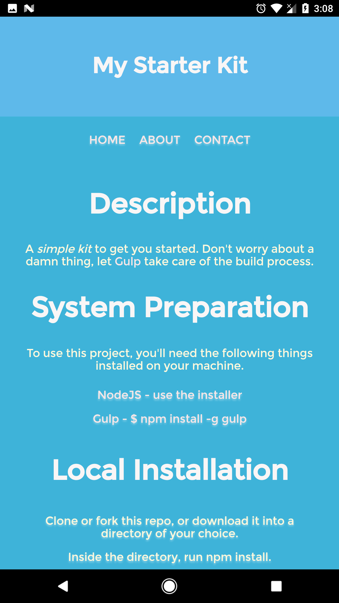

My starter kit
=============================

## Description

A simple kit to get you started. Don't worry about a damn thing, let [Gulp](http://gulpjs.com/) take care of the build process.

All you have to do is delete my files and add your own.





## This project uses the following tools

[Gulp](http://gulpjs.com/)
[Pug](https://github.com/pugjs/pug)
[Babel](https://babeljs.io/)
[ESLINT](http://eslint.org/)
[SASS](http://sass-lang.com/)
[Autoprefix](https://autoprefixer.github.io/)
[BrowserSync](https://browsersync.io/)

## System Preparation

To use this project, you'll need the following things installed on your machine.

1. [NodeJS](http://nodejs.org) - use the installer.
2. [GulpJS](https://github.com/gulpjs/gulp) - `$ npm install -g gulp`

## Local Installation

1. Clone or fork this repo, or download it into a directory of your choice.
2. Inside the directory, run `npm install`.

## Usage

**development mode**

Jus type gulp into the terminal of the root of your project. A browser will open and you can view your project while you work and watch the changes happen as you edit and save you files.

```shell
$ gulp
```
